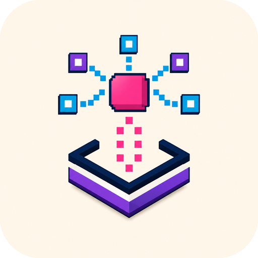
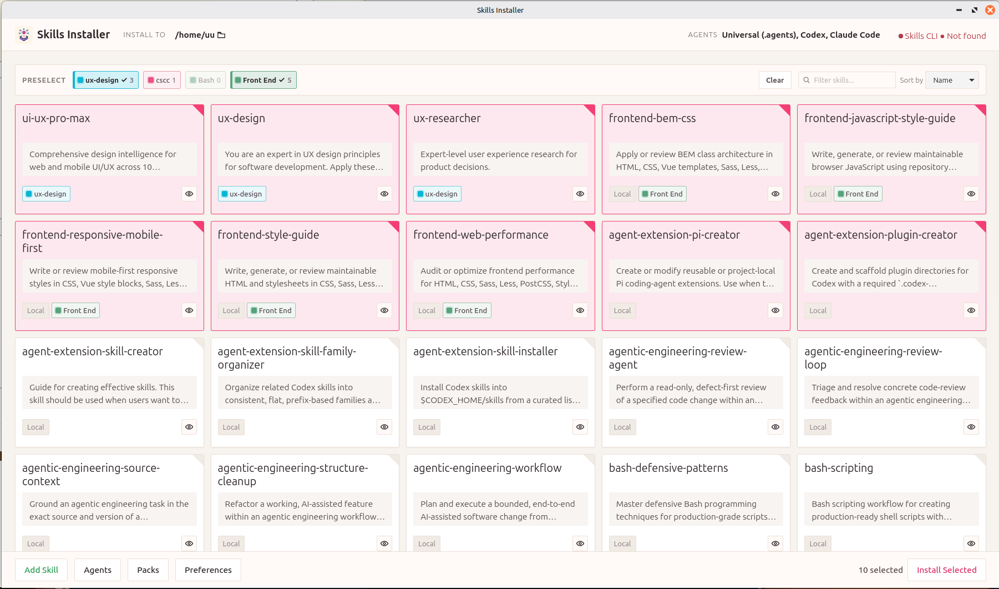

  

  # Skills Installer

  A simple desktop app for finding, organizing, and installing Agent Skills.

Skills Installer gives you one place to manage the skills you use with AI coding agents. Add skills from [skills.sh](https://skills.sh), discover skills stored on your computer, group them into reusable Packs, and install them into the agents and projects you choose.

## What you can do

- Add remote skills using their `skills.sh` URL.
- Discover local skills from a folder on your computer.
- Search and review skill descriptions before installing them.
- Select several skills and install them together.
- Choose which supported AI agents receive each installation.
- Install skills for the current project or make them available globally.
- Create Packs to quickly select groups of related skills.
- Follow installation progress, commands, output, and errors in real time.
- Cancel an installation or continue when an individual skill fails.
- Save your preferences and import or export your configuration.

## How it works

1. Add a skill from `skills.sh`, or choose a folder that contains local skills.
2. Select the skills you want from the main screen.
3. Choose the destination and the AI agents that should receive them.
4. Review your selection and click **Install Selected**.
5. Follow the installation progress directly in the app.

Skills Installer uses the [Skills CLI](https://www.npmjs.com/package/skills) to perform installations. The app shows exactly what is happening while keeping skill selection and organization easy to manage.

  

## Packs

Packs are reusable groups of skills. They are useful when you regularly install the same set of skills for a particular workflow, such as frontend development, testing, documentation, or code review.

Selecting a Pack selects its assigned skills in one step. Packs organize your choices; they do not create extra copies of your skills.

## Local skills

You can point the app to a folder containing local skill definitions. Skills Installer discovers folders with a `SKILL.md` file and adds them to the catalog alongside remote skills.

The local folder is only a source. You still choose the project or global destination when installing.

## Graphical app and command line

Skills Installer can be used as a desktop application or from the command line. Both provide access to the same catalog and installation behavior.

Run `skills-installer` to open the desktop app, or use `skills-installer --help` to see the available command-line options.

## Requirements

- Linux
- The Skills CLI, or `npx` so the app can run it when needed
